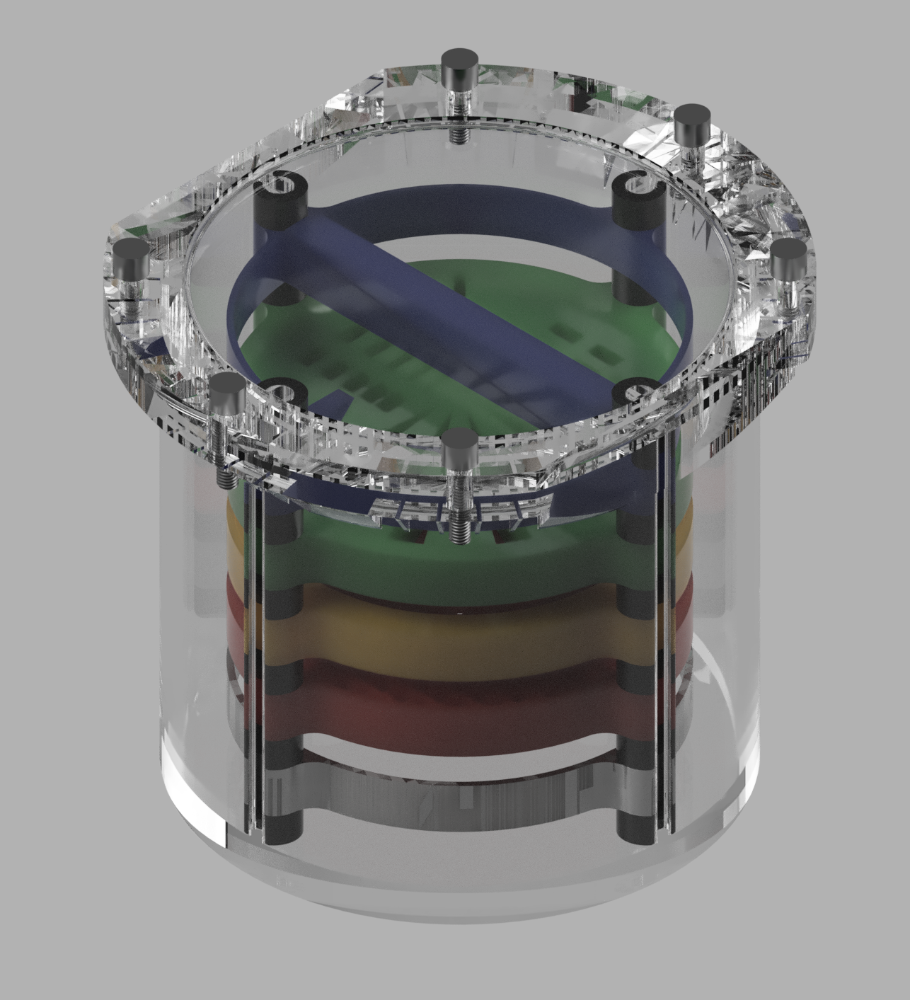
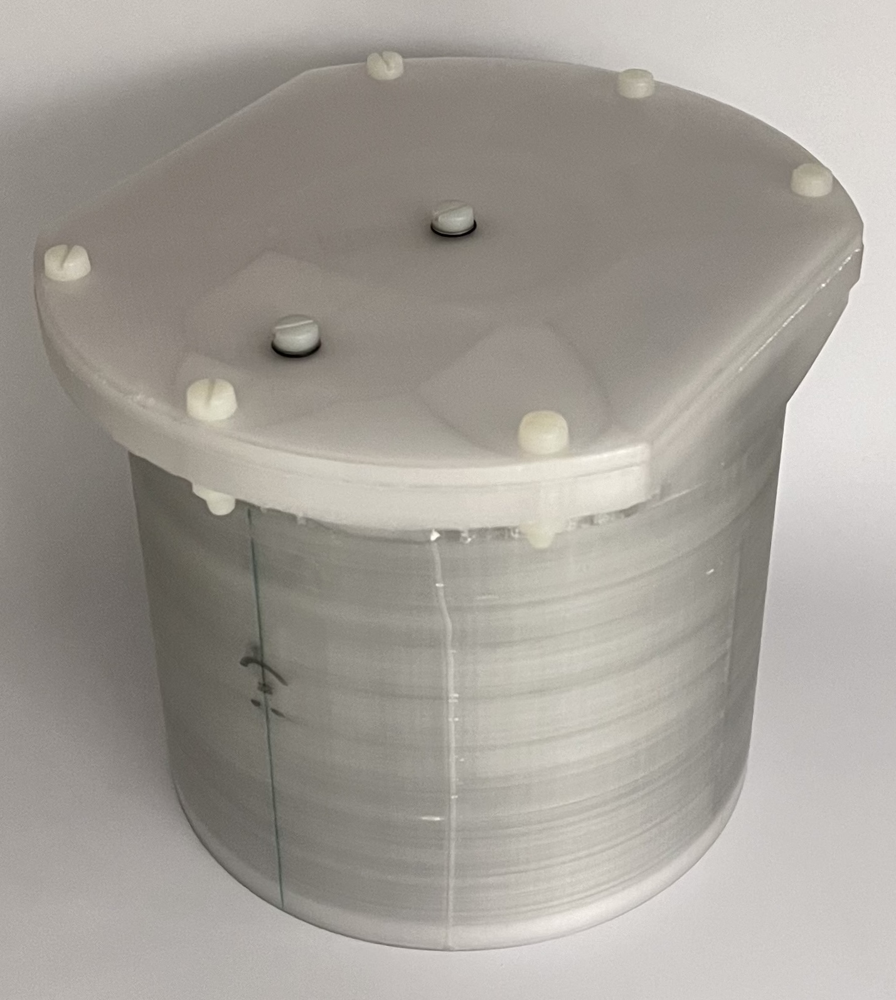
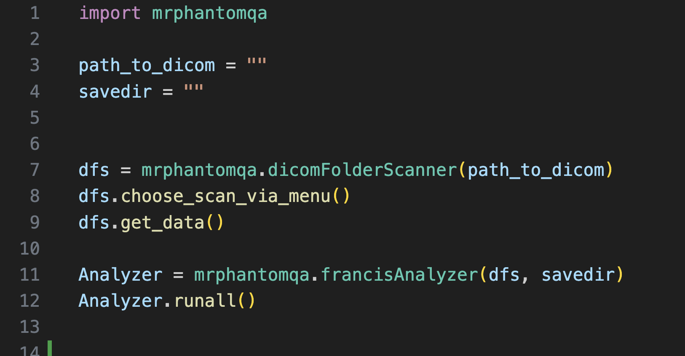
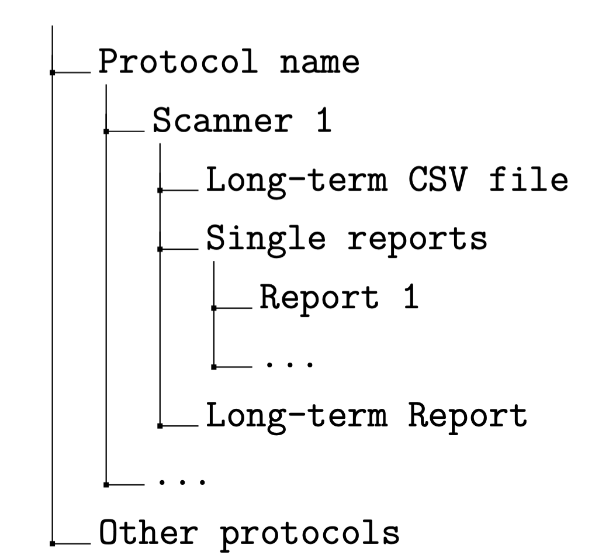

# What is this repository?
This repository houses software to automatically evaluate Dicom data for different MRI Quality Assuracne protocols such as common ones by the Americal College of Radiology (ACR) to the fMRI QA protocol by Friedman and Glover (according to DOI 10.1002/jmri.20583). On top of this is the analysis for a custom protocol included, the so called OrQA protocol. The goal of designing this protocol is to provide a similar phantom to the ACR one but with a modular design and smaller size, since this protocol was designd with small pTx coils present e.g. at 7T scanners in mind.

# What is the OrQA Protocol?
The Open regular Quality Assurance (OrQA) Protocol is inspired by the ACR Protocol and comes with a custom, 3D-printed phantom. Key considerations are a matching size for all scanners, ease of use for operators in scanning and evaluating the data and furthermore modularity. The last point plays a key role, because it means that improvements can be made fast and without compromising the whole phantom, which will be saving money and especially printing time allowing for rapid prototyping and easy parts replacement.

<p float="left">
  
   
</p>

The OrQA Phantom consists of a cylindrical case which measures 160mm in outer diameter and 142mm in height, not including the lid. The inner part of the phantom is 148mm in diameter and 132mm in height. The inner part houses four rails at the side of the walls. This case houses the modules and is filled with saline solution which is MR-visible. Earlier versions were filled with pure water but had problems with signal outages at 7T caused by suboptimal electric conductivity. The used materials used for the phantom are polyethylene terephthalate glycol (PETG) and polylactide (PLA) which are MR-opaque and have a similar susceptibility to water.

# How to run the Evaluation software?
## Set up the Conda environment
The software is written in Python and runs inside a Conda environment. The environment is provided under _conda\_env.yml_ and is created by this command

```
conda env create -f conda_env.yml
```

The environments name is _karo_ and is activated by

```
conda activate karo
```

## Run the software
To run the software choose one of the start scripts in the directory. 


Two filepaths are defined in the first lines:
_path\_to\_dicom_ is the path the dicom data is stored at.
_savedir_ is the path where the reports will be saved.

Two objects are initialized.  
***dicomFolderScanner*** prepares the Dicom data and produces a 4D array (time, slice, Y, X).
- _Choose\_scan\_via\_menu()_ shows menu and operator can choose a scan. With the flag _True_, the latest scan in the folder will be chosen automatically.
- _dfs.list_scans_ can be used alternativaly to show a list of all scans inside a folder and a specific scan be used via _dfs.choose\_scan("SEQUENCE\_NAME")_ . 
- _get\_data()_ creates the 4D array (time, slice, y, x) with metadata stored at _dfs.metadata_ .

***{francis|glover|acr}Analyzer*** analyzed the dicom data according to the three proposed protocols \*. 
- _runall_ runs all necessary methods in order to evaluate the data and outputting results in the following way:




*The OrQA protocol is currently referred by the name Francis in the software for historical reasons
